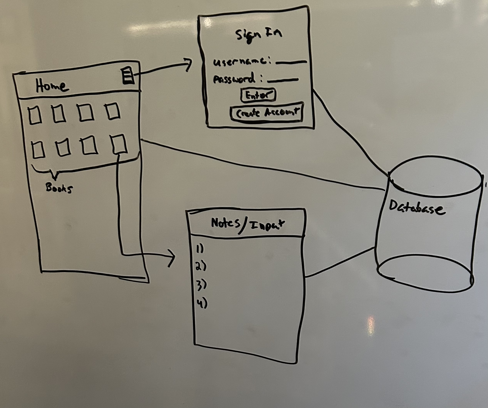
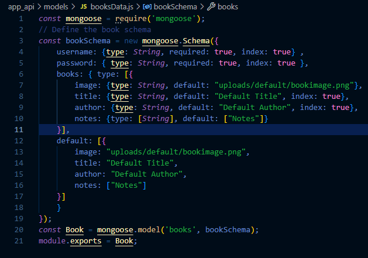

# Computer Science Capstone ePortfolio
❗❗❗[Live Capstone Project](https://kbbookapp.xyz/)❗❗❗

❗❗❗[Project Code Base](https://github.com/restodruid1/DigitalBookLibrary)❗❗❗
### Professional Self-Assessment
My time at SNHU has been a great experience and has shaped me into the developer that I am today. Through the coursework and this ePortfolio I have learned the fundamentals of computer science and what is expected of me as a professional developer. In my reflection, I determined that there were four classes that had a profound impact on me: Software Development Life Cycle, Software Security, Data Structures and Algorithms, and Full-Stack Development. SDLC taught me the various methods that companies use to develop and deploy software. Most importantly, it taught me how corporations work so that I could use the strategy for my own projects and so that I could meet expectations in the workforce and better collaborate in a team environment. Software Security was influential to me because it emphasized the importance of security in software, and that it is to be taken serious in all phases of development. Data Structures and Algorithms was another influential course because it is a foundational concept in computer science and it plays a major role in the success of professional software. Lastly, the Full-Stack course inspired me to build this web app because I wanted to create an application that involved all aspects of my computer science journey and what better way than to build an entire full-stack application and deploy it to the web. This program combined with inspiration through its acceptance of me, has given me confidence and shaped me into the developer I am today. I take pride in my knowledge of computer science fundamentals and my ability to learn and apply new technologies.

I wanted this portfolio to be an encompassing project that showcased my diverse skillset through the development and deployment of a full-stack website as opposed to enhancing three different artifacts. Not only does this show my ability to meet the outcomes of software design and engineering, algorithms and data structures, and databases, but it also shows my ability to bring the project to life and provide functionality in the real world, not just in testing. For the software design and engineering portion, I chose to use the MEAN (MongoDB, Express, Angular, NodeJS) stack because of its uniform language of JavaScript that made things like talking to the database simpler and so that I could focus on the logic instead of the coding language. I also chose to implement the Model-View-Controller (MVC) architecture for its simplicity, organization, and scalability. For the algorithms and data structures portion I opted to keep things simple, but efficient by using arrays for storing data in memory and objects/dictionaries in the database. Additionally, my algorithms consisted of linear time operations, often on the frontend, to achieve the desired functionality. These simple algorithms and data structures were sufficient for the purposes of the application and I ensured that no egregious algorithms like exponential run-time were used when a linear run-time algorithm was possible. Lastly, for the database portion I used a singular MongoDB collection for the entirety of the app as this is what made the most sense to me. I then created an API for the frontend to talk to the database so that the user data could be utilized to provide dynamic content
### Code Review
Click [here](https://www.youtube.com/watch?v=0ckaHZqYi-g) to view my code review for this project.
### Desired Outcome From This Project
Through this capstone project, I demonstrate my mastery of the following five outcomes:
1. Employ strategies for building collaborative environments that enable diverse audiences to support organizational decision making in the field of computer science
2. Design, develop, and deliver professional-quality oral, written, and visual communications that are coherent, technically sound, and appropriately adapted to specific audiences and contexts
3. Design and evaluate computing solutions that solve a given problem using algorithmic principles and computer science practices and standards appropriate to its solution, while managing the trade-offs involved in design choices
4. Demonstrate an ability to use well-founded and innovative techniques, skills, and tools in computing practices for the purpose of implementing computer solutions that deliver value and accomplish industry-specific goals
5. Develop a security mindset that anticipates adversarial exploits in software architecture and designs to expose potential vulnerabilities, mitigate design flaws, and ensure privacy and enhanced security of data and resources

### Project Categories
The goal of the project was to demonstrate my abilities in three categories:
1. Software Design and Engineering
2. Algorithms and Data Structures
3. Databases
To accomplish this goal, I combined all three categories into one full-stack application and deployed it live to the web via AWS.

### Category One: Software Design and Engineering
This application was coded using the MEAN stack (MongoDB, Express, Angular, NodeJS) because of the uniformity of the Javascript language that is shared. This allowed for seamless integration between all the software. On a side-note, I chose to use plain HTML, CSS, and JS instead of Angular because Angular would have been overkill. Additionally, I designed this app to utlize the MVC architecture to practice writing software that is managable and scalable. Below is the high-level diagram I created to show the various components and how I imagined they would work together.

### Category Two: Algorithms and Data Structures
In terms of data structures and algorithms, this project was fairly straightforward. I was conscious of the data structures and algorithms I was implementing in terms of time and space complexity so I avoided gross inefficiencies. This project relies heavily on the use of built-in objects (hashmaps) to communicate with various components when passing data through the application. I considered alternatives where I could, but I decided that for the purposes of the project, the tradeoff was not worth the time.

### Category Three: Databases
The database of choice was MongoDB which is a NoSQL database that stores data in JSON-like documents. I chose this database because it pairs well with JavaScript which made communication seamless. The database is a vital component to any full-stack application as it allowed my app to have persistent and dynamic data for the frontend. Below is the schema I designed. It is a singular collection that contains all the user data needed for the application functionality.

### Final Product
To cap the project off, I created an EC2 instance on Amazon Web Services(AWS) where I configured the Linux virtual machine to be a webserver that hosts my application. From this I learned about the following:
- Cloud technologies
- Linux
- Virtual Machines
- ssh
- DNS
- Networking
- Security

❗❗❗[Live Capstone Project](https://kbbookapp.xyz/)❗❗❗

❗❗❗[Project Code Base](https://github.com/restodruid1/DigitalBookLibrary)❗❗❗
